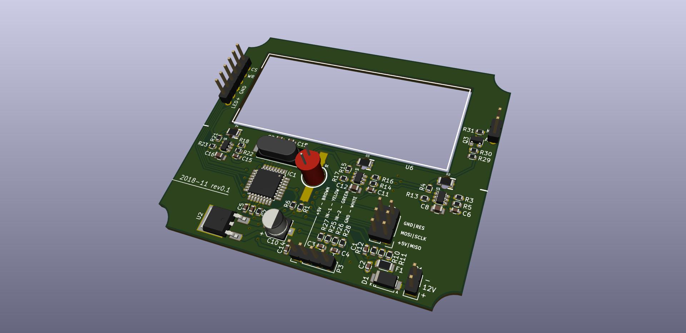
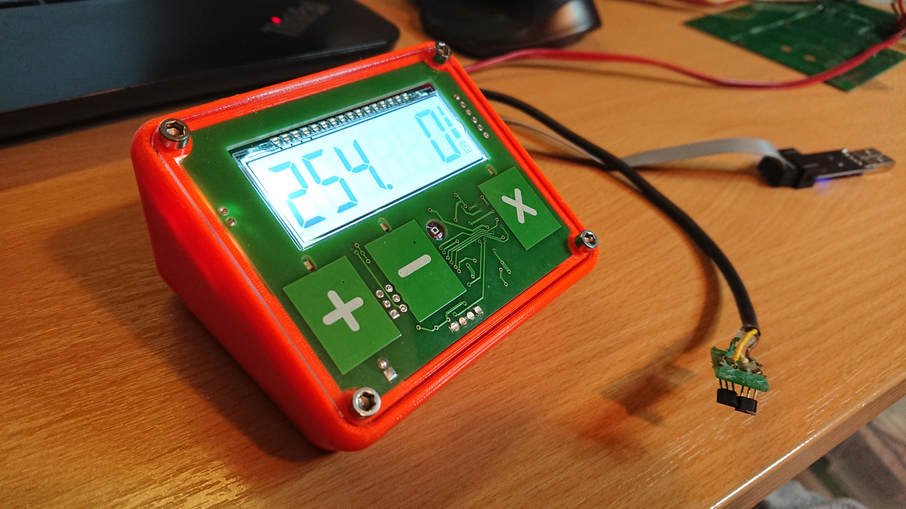

# Fishing-reel-control 

KiCad PCB layout

* [Interactive bom!](http://htmlpreview.github.io/?https://github.com/ok1hra/Fishing-reel-control/blob/master/KiCad-PCB/ibom.html)
* [STEP 3D model of PCB](KiCad-PCB/Ali-FM.step)

* [Firmware](https://github.com/ok1hra/Fishing-reel-control/tree/master/Arduino_firmware)

## Functionality
* Show battery voltage at start up
* LCD show counter, speed in metre unit + battery voltage bargraph
* Capacitive button sensor for up, down an reset with LED light feedback
* Ambient light sensor automaticaly adjust LCD backlight
* After 20 seconds storage last value, for recovery after restart power
* 12V DC power input
* Counter input for two hall effect switch
* Waterproof 3D printed case (PET)
